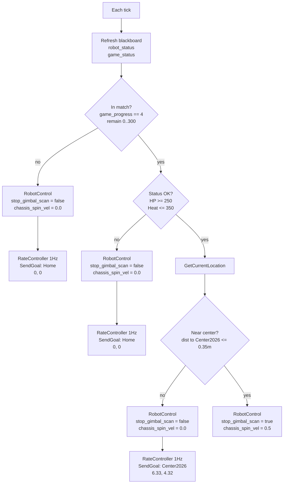

# Current behavior tree flow

Last updated: 2026-04-11

## 0. Document roles (five-doc split)

| Document | Role |
|------|------|
| [README.md](README.md) | **Central index**: one-page overview, diagram, build order, shortest startup |
| [README_COMMUNICATION.md](README_COMMUNICATION.md) | **Comms & protocol**: `sentry_bridge`, SP/SX/ST, PTY, frames, `serial_sender`, `bt_comm_adapter`, topics; §15.3 hardware comms summary |
| **This doc** | **Behavior trees**: policy XML, diagrams, nodes/plugins, `RobotControl`/`SendGoal` semantics, Groot2, debug scripts, legacy tree index; **§5.1** goal alignment with `watch_*` |
| [README_LIDAR.md](README_LIDAR.md) | **LiDAR + SLAM + Nav2**: **§6.4 Gazebo Sim2Real**, Mid360, FAST-LIO, mapping; **§10.8** hardware navigation prerequisites |
| [README_COMMANDS.md](README_COMMANDS.md) | **Commands & data flow**: [§1 four paths](README_COMMANDS.md#readme-commands-section-1), [§4 `start_robot` env](README_COMMANDS.md#readme-commands-section-4), [§12 hardware bring-up](README_COMMANDS.md#readme-commands-section-12) |

**How to choose:** Edit XML / understand `RobotControl` → **this doc**; serial and MCU protocol → [README_COMMUNICATION.md](README_COMMUNICATION.md); unstable LiDAR/localization → [README_LIDAR.md](README_LIDAR.md); copy-paste commands, env vars, map filenames, phased hardware steps → [README_COMMANDS.md](README_COMMANDS.md).

**Boundary vs other docs:** End-to-end paths A–D and MCU duties: [README_COMMANDS.md §1](README_COMMANDS.md#readme-commands-section-1). **Map swap, `MAP_FILE`, PCD→PGM commands:** [README_COMMANDS.md](README_COMMANDS.md) **§4.4, §7**; this doc stresses **tree coordinates and watcher args must match XML** (§5.1).

---

This document focuses on the default debug tree **`center_attack_simple.xml`**, plus framework notes and legacy trees like **`retreat_attack_left`**.

**Which tree runs where**

- Recommended debug / mechanical-limits variant:
  - `rm_decision_ws/rm_behavior_tree/config/center_attack_simple.xml`
- `run_test_a.sh` / `run_test_a_headless.sh` default:
  - `style:=center_attack_simple`
- `start_robot.sh` default:
  - `style:=center_attack_simple`

So if you tune “match start → center → hold → low HP home”, `run_test_a.sh` and `start_robot.sh` already target the same tree.

## 1. Summary

`center_attack_simple.xml` is a simplified state machine for current mechanical limits:

- Match started and status OK:
  - Navigate to a free point near `RMUL2026` center
  - Keep gimbal scanning while moving
  - No chassis spin
- Near center:
  - Stop scan; hand gimbal to auto-aim
  - In-place chassis spin
  - No further active navigation
- Pre-match, or low HP / high heat:
  - Return to `Home(0.8, 7.8)`
  - Gimbal keeps 360° scan
  - No chassis spin

**Differences from older trees**

- No vision-based branch switching
- No `/all_robot_hp` dependency
- No time-window goal hopping
- No spin-while-transit
- Only three high-level states:
  - Standby / home
  - Approach center
  - Center hold / attack

## 2. Code entry points

- Behavior tree executable:
  - `rm_decision_ws/rm_behavior_tree/src/rm_behavior_tree.cpp`
- Current simple tree XML:
  - `rm_decision_ws/rm_behavior_tree/config/center_attack_simple.xml`
- “Near goal” condition node:
  - `rm_decision_ws/rm_behavior_tree/plugins/condition/is_near_goal.cpp`
- Groot project:
  - `rm_decision_ws/rm_behavior_tree/config/Project.btproj`

## 3. Inputs and outputs

### 3.1 Inputs

This tree reads two inputs per tick:

- `robot_status`
- `game_status`

Unlike old trees, it does not use:

- `/detector/armors`
- `/all_robot_hp`

**Note:** Not subscribing to `/detector/armors` does **not** mean “vision is unused”. Auto-aim and tracking are still **vision → SP → MCU**. This tree uses **`RobotControl`** (`allow_vision_control`, `scan_enabled`, etc.) to switch **scan vs allow auto-aim**, and does **not** put “saw armor” in BT conditions. See [README_COMMANDS.md](README_COMMANDS.md) §3.2.

### 3.2 Outputs

- `SendGoal`
  - Feeds Nav2 `navigate_to_pose`
- `RobotControl`
  - Published on `/robot_control`
  - Main XML fields (vary by hold vs transit):
    - `stop_gimbal_scan`, `chassis_spin_vel`
    - `scan_enabled`, `allow_vision_control`, `search_when_target_lost`
    - `scan_yaw_rate_deg_s`, `search_pitch_deg`

## 4. Hard prerequisites

- `game_status`
  - Main gate; if missing or `game_progress != 4`, match logic does not run
- `robot_status`
  - Gates hold-at-center; if `HP < 250` or `shooter_heat > 350`, the tree returns home

## 5. Key goals and thresholds

`center_attack_simple.xml` hard-codes:

- `Home` — `(0.8, 7.8)`
- `Center2026` — `(6.33, 4.32)`
- `IsNearGoal` distance — `0.35 m`
- Hold spin — `0.5 rad/s`
- Status — `HP >= 250`, `shooter_heat <= 350`

`OccupyCenter(3.0, 0.4)` from the old tree is not reused because that pose sits in an obstacle on `RMUL2026.pgm`.

### 5.1 Align `watch_center_attack_state.py` with XML

`scripts/watch_center_attack_state.py` takes **home/center** from CLI; **defaults may not match** XML `Home(0.8, 7.8)` and `Center2026(6.33, 4.32)` (older sim/map defaults). On hardware or after a map change, **pass the same numbers as `center_attack_simple.xml`**, e.g.:

```bash
python3 scripts/watch_center_attack_state.py \
  --home-x 0.8 --home-y 7.8 \
  --center-x 6.33 --center-y 4.32
```

When swapping maps, changing origin, or field orientation, reconcile **XML `SendGoal`, `BT_START_GOAL` / `BT_END_GOAL`, and watcher args** (tools: [README_COMMANDS.md](README_COMMANDS.md) **§4.4, §7.4**).

**Phased hardware bring-up, mock `/game_status` and `/robot_status`, BT debug scripts:** [README_COMMANDS.md §12](README_COMMANDS.md#readme-commands-section-12).

## 6. Main flow diagram



## 7. Structure expanded from code

```text
ReactiveSequence
├─ SubRobotStatus(topic_name="robot_status")
├─ SubGameStatus(topic_name="game_status")
└─ WhileDoElse [In match?]
   ├─ TRUE -> WhileDoElse [HP>=250 and Heat<=350 ?]
   │  ├─ TRUE -> WhileDoElse [dist to Center2026 <= 0.35m ?]
   │  │  ├─ TRUE  -> RobotControl(stop_gimbal_scan=True,  chassis_spin_vel=0.5)
   │  │  └─ FALSE -> ReactiveSequence
   │  │     ├─ RobotControl(stop_gimbal_scan=False, chassis_spin_vel=0.0)
   │  │     └─ SendGoal(Center2026)
   │  └─ FALSE -> ReactiveSequence
   │     ├─ RobotControl(stop_gimbal_scan=False, chassis_spin_vel=0.0)
   │     └─ SendGoal(HomeRecover)
   └─ FALSE -> ReactiveSequence
      ├─ RobotControl(stop_gimbal_scan=False, chassis_spin_vel=0.0)
      └─ SendGoal(HomeStandby)
```

## 8. Node cheat sheet

### 8.1 `IsGameTime`

**Success when**

- `msg->game_progress == 4`
- `stage_remain_time` in the allowed window

**In this tree**

- Only “match started / not”

### 8.2 `IsStatusOK`

**Success when**

- `current_hp >= hp_threshold`
- `shooter_heat <= heat_threshold`

**Fixed here**

- `HP >= 250`
- `Heat <= 350`

### 8.3 `GetCurrentLocation`

- Reads `map -> base_link` TF for `IsNearGoal`

### 8.4 `IsNearGoal`

- Planar distance to goal `<= dist_threshold`
- Here: reached `Center2026`

### 8.5 `RobotControl`

- `scan_enabled` — enable scan
- `allow_vision_control` — allow vision auto-aim
- `search_when_target_lost` — return to scan search
- `scan_yaw_rate_deg_s` — scan yaw rate
- `search_pitch_deg` — scan/search pitch
- `chassis_spin_vel` — chassis spin
- `stop_gimbal_scan` — legacy; still used but not the only lever

## 9. How this reaches the chassis

Two paths:

- `SendGoal -> Nav2 -> /cmd_vel -> /cmd_vel_chassis -> bt_comm_adapter.py -> /cmd_vel_chassis_bt`
- `/robot_control.chassis_spin_vel -> bt_comm_adapter.py -> /cmd_vel_chassis_bt`

Then through the bridge:

- `/cmd_vel_chassis_bt -> serial_sender -> Radar PTY -> sentry_bridge.py -> SX -> nyush-rm-control`

So: navigation motion, `chassis_spin_vel` blending, and `RobotControl` feature fields can all reach the MCU **via** `serial_sender (A3) -> bridge -> SX`.

## 10. What this tree intentionally skips

- No `/detector/armors`
- No target class (sentry/infantry/hero/outpost)
- No time windows
- No left/right/supply/mid goal hopping
- No post-hit `MoveAround` (simplified to stabilize “go center and hold” first)

## 11. Debug tips

Minimum stable inputs: `game_status`, `robot_status`.

**Order**

1. Start Gazebo / Nav2
2. Start behavior tree: `style:=center_attack_simple`
3. Manually publish `game_status` and `robot_status`
4. Watch `/goal_pose`, `/robot_control`, Groot2 `IsGameStart / IsStatusOK / IsNearGoal`

**Typical results**

- `game_progress = 0` → `Home(0.8, 7.8)`, scan on, no spin
- `game_progress = 4`, `HP=600`, `heat=0` → go to `Center2026(6.33, 4.32)`, scan on, no spin
- Near `Center2026` → `stop_gimbal_scan=True`, `chassis_spin_vel=0.5`
- `HP=200` or `heat=400` → `Home(0.8, 7.8)`, scan on, no spin

## 12. Legacy trees

- `retreat_attack_left.xml` still exists
- `start_robot.sh` default is `center_attack_simple`
- Old tree = time windows + vision + friendly HP, etc. — use only when you set `BT_STYLE=retreat_attack_left`

---

## 13. Entry points, parameters, plugin registration

### 13.1 Executable and tick

- **Source:** `rm_decision_ws/rm_behavior_tree/src/rm_behavior_tree.cpp`
- **Behavior:** `BehaviorTreeFactory`, register plugins, load **XML**, **`tree.tickWhileRunning(10ms)`**
- **Launch:** `ros2 launch rm_behavior_tree rm_behavior_tree.launch.py style:=<name without .xml> use_sim_time:=True/False`
  - `style` becomes node param `style`; usually resolved to `config/<style>.xml`

### 13.2 Common node parameters

| Param | Meaning |
|------|------|
| `style` | BT XML (e.g. `center_attack_simple`) |
| `start_goal_pose` / `end_goal_pose` | Blackboard strings (debug / some trees) |
| `enable_groot` | Groot2 publisher |
| `groot_port` | Groot2 port, default **1667** |

### 13.3 ROS subscriber plugins (`msg_update_plugin_libs`)

Registered **before** generic plugins:

| Library | Typical use |
|----------|------|
| `sub_all_robot_hp` | `/all_robot_hp` |
| `sub_robot_status` | `robot_status` (topic from XML) |
| `sub_game_status` | `game_status` |
| `sub_armors` | `/detector/armors` |

`center_attack_simple.xml` does **not** use `SubArmors` / `SubAllRobotHP` in the tree; unused plugins have no effect.

### 13.4 Non-ROS plugins (`bt_plugin_libs`)

| Plugin | Role | Notes |
|------|------|------|
| `rate_controller` | Decorator | Rate-limit children (e.g. `SendGoal` 1 Hz) |
| `is_game_time` | Condition | Match phase / time |
| `is_status_ok` | Condition | HP / heat |
| `is_detect_enemy` | Condition | Armor list non-empty |
| `is_near_goal` | Condition | Distance (with `GetCurrentLocation`) |
| `is_attacked` | Condition | Attacked flag |
| `is_friend_ok` / `is_outpost_ok` | Condition | Teammate / outpost |
| `get_current_location` | Action | `map`→`base_link` |
| `move_around` | Action | Evade, etc. |

### 13.5 ROS publisher plugins (`RegisterRosNode`)

| Plugin | Default topic | Notes |
|------|--------|------|
| `send_goal` | `goal_pose` | Nav2 `navigate_to_pose` |
| `robot_control` | `robot_control` | `RobotControl` msg |

---

## 14. `RobotControl` message and node

**Def:** `rm_decision_ws/rm_decision_interfaces/msg/RobotControl.msg`

| Field | Type | Meaning |
|------|------|------|
| `stop_gimbal_scan` | bool | Legacy: stop scan, prep for auto-aim |
| `chassis_spin_vel` | float32 | Chassis spin (rad/s) → `bt_comm_adapter` → `/cmd_vel_chassis_bt.angular.z` |
| `scan_enabled` | bool | Scan mode |
| `allow_vision_control` | bool | Allow vision takeover |
| `search_when_target_lost` | bool | Return to scan on loss |
| `scan_yaw_rate_deg_s` | float32 | Scan yaw (deg/s) |
| `search_pitch_deg` | float32 | Scan/search pitch (deg) |

**Impl:** `plugins/action/robot_control.cpp` — default `0` / `false` for unconnected ports, then XML `getInput` overrides.

---

## 15. Config files (`rm_behavior_tree/config/*.xml`)

| File | Use |
|------|-----|
| `center_attack_simple.xml` | **Default**: center hold + home on low HP; only `game_status` + `robot_status` |
| `center_attack_fullstack.xml` | Full-stack / extended (names may match launch) |
| `retreat_attack_left.xml` | Legacy: time windows, vision, friend HP, supply |
| `attack_left.xml` / `attack_right.xml` | Side attacks |
| `protect_supply.xml` | Hold supply |
| `rmuc_01.xml` | RMUC preset |

```bash
BT_STYLE=retreat_attack_left ./start_robot.sh
# or
ros2 launch rm_behavior_tree rm_behavior_tree.launch.py style:=retreat_attack_left
```

---

## 16. `retreat_attack_left` (summary)

> Full conditions in XML; compare with `center_attack_simple`.

Typical top level:

```text
ReactiveSequence (refresh subs each tick)
├─ SubAllRobotHP, SubArmors, SubRobotStatus, SubGameStatus
└─ WhileDoElse [in match game_progress=4]
   ├─ TRUE → main: vision / status / time / friend HP → many SendGoal + RobotControl
   └─ FALSE → standby: home + RobotControl
```

**vs simple tree:** hard dependency on `/detector/armors`, `/all_robot_hp`, **MoveAround**, multiple goals; needs referee/vision or `bt_comm_adapter` fallbacks.

---

## 17. Nav2, `bt_comm_adapter`, MCU (BT view)

```text
SendGoal → navigate_to_pose → Nav2 → /cmd_vel → fake_vel_transform → /cmd_vel_chassis
RobotControl → /robot_control ────────────────────────────────┐
                                                               ▼
                                              bt_comm_adapter → /cmd_vel_chassis_bt
                                                               → serial_sender → Radar PTY → … → MCU
```

- **Translation** mostly from Nav2 → `/cmd_vel_chassis.linear.*`
- **Spin** from **`chassis_spin_vel`**, not Nav2 `angular.z` (see `scripts/bt_comm_adapter.py`)

---

## 18. Debug scripts (`scripts/`)

| Script | Role |
|------|------|
| `bt_hotkey_debug.py` | Keyboard `game_status` / `robot_status` presets |
| `watch_center_attack_state.py` | Terminal state for `center_attack` |
| `run_test_a.sh` / `run_test_a_headless.sh` | **No LiDAR**: fake sensors + Nav2 + BT, default `center_attack_simple` |
| `test_behavior_chain.py` | Behavior chain helper |
| `start_fullstack_sequence.sh` | **Spawns many gnome-terminals**; for daily work prefer 2–3 manual terminals per `README_COMMUNICATION.md` |
| `start_fullstack_headless.sh` | Headless background + logs (systemd) |

### 18.1 Groot2 workflow

0. **Start Groot2** (team uses desktop **AppImage**; name varies):

```bash
cd ~/Desktop
./Groot2-v1.9.0-x86_64.AppImage
```

See **[mid360 command.txt](mid360%20command.txt)** §13; use your local `Groot2-*-x86_64.AppImage` filename.

1. Launch `rm_behavior_tree` with **`enable_groot:=true`** (`run_center_attack_debug_session.sh`: **`ENABLE_GROOT=True`**).
2. Open **`rm_behavior_tree/config/Project.btproj`**.
3. **Monitor** → **`127.0.0.1:1667`** (or `groot_port`).
4. Free edition has node limits; trim subtrees to debug one branch.

**Gazebo:** recommended order in [README_LIDAR.md](README_LIDAR.md) **§6.4** (`bringup_sim` → `run_center_attack_debug_session.sh` → Groot2).

### 18.2 `goal_pose` string format

`SendGoal` uses:

```text
x;y;z; qx;qy;qz;qw
```

Parsed via `bt_conversions.hpp` to `PoseStamped`. Avoid odd leading spaces in XML (mitigated with trim).

---

## 19. Source quick reference

| Item | Path |
|------|------|
| Main | `rm_decision_ws/rm_behavior_tree/src/rm_behavior_tree.cpp` |
| Groot | `rm_decision_ws/rm_behavior_tree/config/Project.btproj` |
| `RobotControl` plugin | `rm_decision_ws/rm_behavior_tree/plugins/action/robot_control.cpp` |
| `SendGoal` | `rm_decision_ws/rm_behavior_tree/plugins/action/send_goal.cpp` |
| `IsNearGoal` | `rm_decision_ws/rm_behavior_tree/plugins/condition/is_near_goal.cpp` |
| Messages | `rm_decision_ws/rm_decision_interfaces/msg/*.msg` |
| Adapter | `sentry_planner/scripts/bt_comm_adapter.py` |

---

## 20. Cross-references

| Need | Doc |
|------|------|
| End-to-end path, hardware terminals, `ros2 topic pub` | [README_COMMANDS.md](README_COMMANDS.md) **§1, §12, §13** |
| `RobotControl` on wire / `serial_sender` | [README_COMMUNICATION.md](README_COMMUNICATION.md) **§11** |
| `MAP_FILE`, `11_map` / `RMUL2026`, retune on map change | [README_COMMANDS.md](README_COMMANDS.md) **§4.4, §7** |
| Gazebo, `bringup_sim`, Sim2Real, mock referee | [README_LIDAR.md §6.4](README_LIDAR.md#nyush-gazebo-sim2real), [mid360 command.txt](mid360%20command.txt) |
| `navigate_to_pose`, localization vs field | [README_LIDAR.md](README_LIDAR.md) **§10.8** |
| Central index | [README.md](README.md) |
