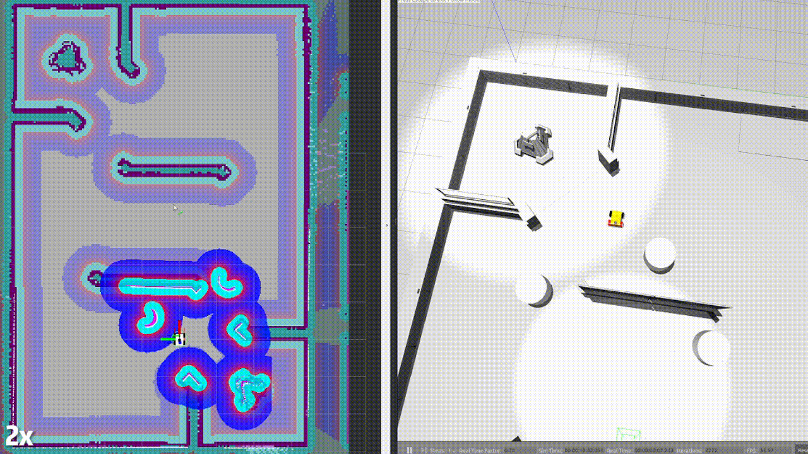
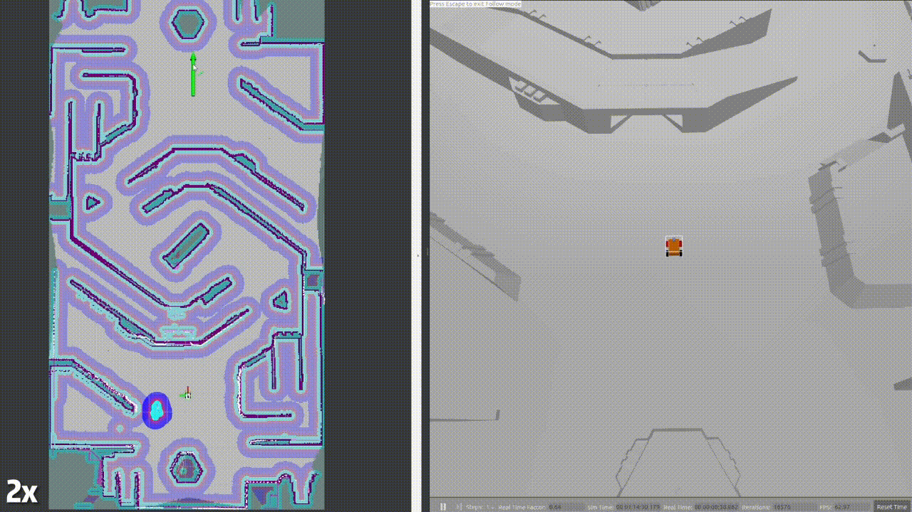

# PB_RM_Simulation

Shenzhen MSU-BIT University **Polarbear** team — sentry navigation simulation and real-robot packages.

## 1. Overview

This project uses an omnidirectional mobile base with a Livox Mid360 lidar and IMU for navigation in RMUC/RMUL-style maps in simulation. Tune parameters to port the same stack to the physical robot.

Early demo: [Winter at home, how to tune the car!? RM nav sim for beginners](https://b23.tv/xSNQGmb)

|Gazebo simulation|Fast_LIO/Point_LIO + Navigation2|
|:-:|:-:|
|||

|Dynamic obstacle avoidance|
|:-:|
||

|“One-shot base push”|
|:-:|
||

### 1.1 `rm_simulation` topics

| **Topic name**      | **Type**                        | **Note**                         |
|:-------------------:|:-------------------------------:|:--------------------------------:|
| /livox/lidar             | livox_ros_driver2/msg/CustomMsg | Mid360 custom message   |
| /livox/lidar/pointcloud | sensor_msgs/msg/PointCloud2     | ROS 2 point cloud                      |
| /livox/imu                | sensor_msgs/msg/Imu             | Gazebo plugin IMU                  |
| /cmd_vel            | geometry_msgs/msg/Twist         | Omnidirectional base interface                  |

### 1.2 Block diagram


## 2. Environment

Developed on Ubuntu 22.04, ROS 2 Humble, Gazebo Classic 11.10.0.

### Option A: Docker

A base `Dockerfile` is provided; use [Dev Containers](https://containers.dev/) for sim and dev.

> Dev Containers isolate the runtime from the repo (workspace is mounted). The image holds only system setup (e.g. shell, dependencies), not project code. Configure via `devcontainer.json`. Works well with VS Code one-click launch.

Jetson / arm64 note: the provided [dockerfile](dockerfile) is architecture-safe. Native Jetson builds will resolve the `arm64` ROS base automatically; on x86 hosts use `docker build --platform linux/arm64 ...` if you need a Jetson image.

Build locally:

```sh
docker build -f rm_navigation_ws/dockerfile -t rm-nav:humble .
```

Run with host networking and device access (recommended for Mid-360 / real robot bring-up):

```sh
docker run --rm -it \
  --network host \
  --privileged \
  -v /dev:/dev \
  -v $HOME/.ros:/root/.ros \
  -v $(pwd):/ros_ws/src/sentry_planner \
  rm-nav:humble
```

Inside the container, source ROS and build your mounted workspace as usual:

```sh
source /opt/ros/humble/setup.bash
cd /ros_ws
rosdep install --from-paths src --ignore-src -r -y
colcon build --symlink-install
```

Image: [DockerHub: lihanchen2004/pb_rm_simulation](https://hub.docker.com/repository/docker/lihanchen2004/pb_rm_simulation)

1. Install Docker
2. Pull the image

    ```sh
    docker pull lihanchen2004/pb_rm_simulation:1.0.0
    ```

3. In VS Code on the host, install `ms-vscode-remote.remote-containers`
4. `Ctrl+Shift+P` → `Dev Containers: Rebuild and Reopen in Container`

### Option B: From source

1. Clone

    ```sh
    git clone --recursive https://gitee.com/SMBU-POLARBEAR/pb_rmsimulation --depth=1
    ```

2. Install [Livox SDK2](https://github.com/Livox-SDK/Livox-SDK2)

    ```sh
    sudo apt install cmake
    ```

    ```sh
    git clone https://github.com/Livox-SDK/Livox-SDK2.git
    cd ./Livox-SDK2/
    mkdir build
    cd build
    cmake .. && make -j
    sudo make install
    ```

3. Dependencies

    ```sh
    cd pb_rm_simulation

    rosdep install -r --from-paths src --ignore-src --rosdistro $ROS_DISTRO -y
    ```

4. Build

    ```sh
    colcon build --symlink-install
    ```

## 3. Running

### 3.1 Launch arguments

1. `world`:

    - Simulation
        - `RMUL` — [2024 RoboMaster 3v3 field](https://bbs.robomaster.com/forum.php?mod=viewthread&tid=22942&extra=page%3D1)
        - `RMUC` — [2024 RoboMaster 7v7 field](https://bbs.robomaster.com/forum.php?mod=viewthread&tid=22942&extra=page%3D1)

    - Real robot: custom name; `world` matches the prefix of the `.pcd` (ICP) and `.yaml` (Nav2 map) files

2. `mode`:
   - `mapping` — map and navigate at the same time
   - `nav` — navigate with a known global map

3. `lio`:
   - `fastlio` — [Fast_LIO](https://github.com/LihanChen2004/FAST_LIO/tree/ROS2), odometry ~10 Hz
   - `pointlio` — [Point_LIO](https://github.com/LihanChen2004/Point-LIO/tree/RM2024_SMBU_auto_sentry), 100+ Hz odometry, friendlier to navigation, higher CPU

4. `localization` (only when `mode:=nav`):
   - `slam_toolbox` — [slam_toolbox](https://github.com/SteveMacenski/slam_toolbox) localization, stronger in dynamic scenes
   - `amcl` — [AMCL](https://docs.nav2.org/configuration/packages/configuring-amcl.html)
   - `icp` — [icp_registration](https://github.com/baiyeweiguang/CSU-RM-Sentry/tree/main/src/rm_localization/icp_registration): ICP on first start or manual `/initialpose`, then LIO-only; no loop closure, drift over long runs

    Tips:
    1. With AMCL, set the initial pose in RViz2 after startup.
    2. With slam_toolbox localization, you need a `.posegraph` map; see [How to save .pgm and .posegraph?](https://gitee.com/SMBU-POLARBEAR/pb_rmsimulation/issues/I9427I)
    3. With ICP localization, provide a `.pcd` map

5. `lio_rviz`:
   - `True` — visualize Fast_LIO or Point_LIO point cloud map

6. `nav_rviz`:
   - `True` — visualize Nav2

### 3.2 Simulation examples

- Mapping + navigation

    ```sh
    ros2 launch rm_nav_bringup bringup_sim.launch.py \
    world:=RMUL \
    mode:=mapping \
    lio:=fastlio \
    lio_rviz:=False \
    nav_rviz:=True
    ```

- Known map navigation

    ```sh
    ros2 launch rm_nav_bringup bringup_sim.launch.py \
    world:=RMUL \
    mode:=nav \
    lio:=fastlio \
    localization:=slam_toolbox \
    lio_rviz:=False \
    nav_rviz:=True
    ```

### 3.3 Real-robot examples

- Mapping + navigation

    ```sh
    ros2 launch rm_nav_bringup bringup_real.launch.py \
    world:=YOUR_WORLD_NAME \
    mode:=mapping  \
    lio:=fastlio \
    lio_rviz:=False \
    nav_rviz:=True
    ```

    Tips:

    1. Save PCD: in [fastlio_mid360.yaml](src/rm_nav_bringup/config/reality/fastlio_mid360_real.yaml) set `pcd_save_en` to `true` and the output path, then in another terminal run `ros2 service call /map_save std_srvs/srv/Trigger`.
    2. Save grid map: see [How to save .pgm and .posegraph?](https://gitee.com/SMBU-POLARBEAR/pb_rmsimulation/issues/I9427I). Map name should match `YOUR_WORLD_NAME`.

- Known map navigation

    ```sh
    ros2 launch rm_nav_bringup bringup_real.launch.py \
    world:=YOUR_WORLD_NAME \
    mode:=nav \
    lio:=fastlio \
    localization:=slam_toolbox \
    lio_rviz:=False \
    nav_rviz:=True
    ```

    Tips: place the grid map and PCD under `src/rm_nav_bringup/map` and `src/rm_nav_bringup/PCD` with the same basename; pass that prefix as `world`.

### 3.4 Keyboard teleop

```sh
ros2 run teleop_twist_keyboard teleop_twist_keyboard
```

## 4. Real-robot tuning

1. Lidar IP

   [livox_ros_driver2](https://gitee.com/SMBU-POLARBEAR/livox_ros_driver2_humble) is included. Edit [MID360_config.json](./src/rm_nav_bringup/config/reality/MID360_config.json) — `lidar_configs` — `ip`.

2. Lidar relative to chassis center

   x, y matter for gimbal rotation → `base_link` transform quality.

   Fill [measurement_params_real.yaml](./src/rm_nav_bringup/config/reality/measurement_params_real.yaml).

   If the lidar is tilted, do not put rpy here; put the cloud rotation in [MID360_config.json](./src/rm_nav_bringup/config/reality/MID360_config.json) — `extrinsic_parameter`.

3. Lidar height above ground

   Affects ground segmentation. Set in [segmentation_real.yaml](./src/rm_nav_bringup/config/reality/segmentation_real.yaml) — `sensor_height`.

4. `nav2_params`

   Many knobs; `robot_radius` and velocity limits are important. See [Nav2 docs](https://docs.nav2.org/).

## Afterword

> This sim package is both a learning log and a starting point for me.

A year ago in May I barely knew what Ubuntu and ROS were. I joined Polarbear vision as a freshman and barely contributed, then visited the 2023 regional as a spectator. The arena hooked me; I tried deploying another team’s vision stack and wrote my first [algo team notes](https://flowus.cn/lihanchen/facb28a9-5d34-42a7-9bc8-630a182c3571).

Over summer I did a small “express delivery” side competition — first time holding a 2D lidar in a building mapping. Later I saw another team’s “self-driving” sentry at a venue; back on campus, when the captain asked what I wanted for 2024, I said navigation.

I started this repo on a whim. The [first commit](https://gitee.com/SMBU-POLARBEAR/pb_rmsimulation/commit/a3e475ce59c60d68462e4555a76113e4ba1295f1) (2023-09-27) built on [SCAU 2023 RMUL sentry nav](https://github.com/SCAU-RM-NAV/rm2023_auto_sentry_ws) and an RMUC world, adding Mid360 in sim. In 2023-10 Central South FYT open-sourced a ROS 2 nav2 sentry stack — I integrated that style. Wrestling with Gazebo and `ros2 launch` taught me a lot.

Without this sim I might never have touched navigation or so many great open projects. On 2024-01-26 I deployed on a partner’s robot (RMUC joint team); changing launch files made the real car move — unexpected sim-to-real. With no mech program at school, the sentry was finished less than two weeks before league; I lived in “cyber tune” in prep.

On the field, from stands to check-in, we had TF mistakes for an offset lidar when the gimbal rotated — localization wobbled and RMUL never showed smooth pathing. I’m no genius, just a patcher; I learn top-down, fix theory gaps later, and that loop kept me motivated.

## Thanks (in no order)

- Mid360 sim: [livox_laser_simulation](https://github.com/Livox-SDK/livox_laser_simulation/blob/main/src/livox_points_plugin.cpp), [livox_laser_simulation_RO2](https://github.com/stm32f303ret6/livox_laser_simulation_RO2/blob/main/src/livox_points_plugin.cpp), [Issue 15: CustomMsg](https://github.com/Livox-SDK/livox_laser_simulation/issues/15).
- Nav stack: based on [Central South FYT RM sentry stack](https://github.com/baiyeweiguang/CSU-RM-Sentry), with `base_link` modeling, extra localization options, and launch work.

Thanks to **Shockley** (CUHK-Shenzhen) for the gimbal/lidar shared-yaw velocity idea, which became [fake_vel_transform](./src/rm_navigation/fake_vel_transform/).

Thanks to users at Shanghai University of Engineering Science, University of Science and Technology Liaoning, and Shanghai University of Electric Power for deep use and feedback.

And to many others in the RM community who cheered and helped along the way.
